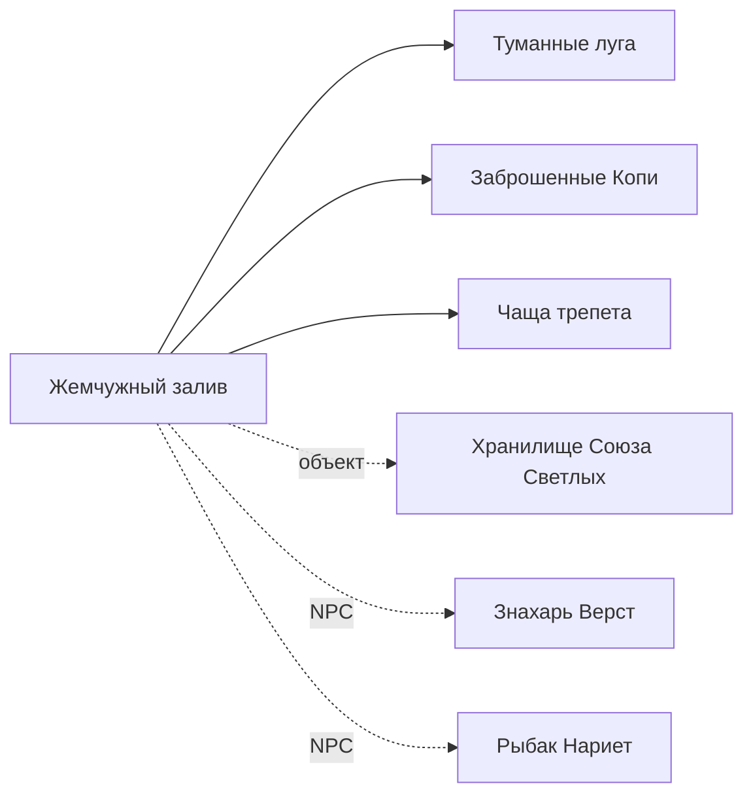
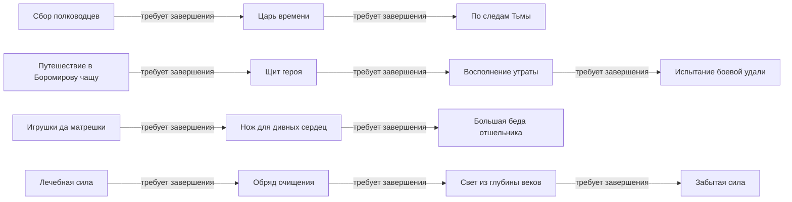

# Карта визуала и активностей «Троецарствия»

Источники: DOM уже открытой пользовательской сессии — [`main.php`](https://3kingdoms.ru/main.php), `main_frame.php`, `area.php`, `cht.php`, `user_quest.php`; а также [официальная библиотека](https://3kingdoms.ru/info/library/).  
Проверено: 17 июля 2026 года.  
Состояние проверки: персонаж 5 уровня, царство Артания; игровые действия, перемещения и принятие заданий не выполнялись.

## Статусы достоверности

- **LIVE** — непосредственно наблюдалось в открытой пользовательской сессии.
- **LIBRARY** — взято из официальной, но потенциально устаревшей библиотеки.
- **INFERRED** — аккуратный вывод из нескольких подтвержденных элементов.
- **UNKNOWN** — данных недостаточно; нельзя переносить в правила автоматизации как факт.

Публичный запрос к `main.php` без сессии возвращает короткий JavaScript-редирект на `/index.php`. Лендинг `index.php` не является игровым экраном. Полный игровой DOM доступен только внутри пользовательской сессии; cookies, токены и содержимое хранилищ при исследовании не читались и в этот файл не помещались.

## Визуальная структура игрового экрана (LIVE)

В наблюдавшемся viewport 1328×1050 интерфейс имел широкую компоновку с фэнтезийной рамкой (LIVE); поведение на других размерах не проверялось:

1. **Верхняя полоса персонажа** — уровень, имя, жизнь, удаль, усталость, слава; справа ряд крупных пиктограмм разделов/режимов.
2. **Левая вертикальная панель** — пять круглых слотов быстрых предметов с числовыми остатками.
3. **Правая вертикальная панель** — `квесты`, `банк`, `рынок`, `почта`, `вещи`, `призвать`, `компас`, `поручения`. В DOM это ссылки класса `b-control-right__item`; недоступные действия получают класс `disabled`.
4. **Центральная сцена** — иллюстрация текущей локации в рамке; поверх возможны счетчики/индикаторы и кнопка режима.
5. **Правая карточка локации** — название, царство, соседние локации, объекты, NPC и таймер перехода.
6. **Центральная рабочая область** — меняется между локацией, квестами, инвентарем и другими разделами.
7. **Разделитель над чатом** — быстрые пункты `[Автоприменение]`, `[Комплекты]`, `Статистика`, `Лог боя`.
8. **Нижняя область** — чат, поле ввода, часы; справа список жителей и кнопки каналов/управления.

В DOM присутствовали элементы управления каналами: местоположение, торговый, клановый, группа, рейд, альянс, царство. Их присутствие не доказывает доступность всех каналов данному персонажу. Также наблюдались очистка, смайлики, фильтр адресованных сообщений и обновление списка игроков.

## Архитектура HTML и JavaScript (LIVE)

`main.php` — оболочка на таблицах и вложенных iframe:

```text
main.php
├── iframe[name=AJAX]          служебный, 1×1
├── iframe#main_frame          основная игровая оболочка
│   ├── iframe[name=main_hidden]
│   ├── iframe[name=devnull]
│   └── iframe#main            рабочая область; начальный src=area.php
├── iframe#chat                чат; src=cht.php
├── iframe#error               служебный, 1×1
└── iframe#smile               смайлики; src=smiles.php
```

Основные ресурсы оболочки: `/js/jquery.js`, `/js/common.js`, `/js/base64.js`, `/js/console_log.js`, `/js/simple_alt.js`, `/js/jquery-ui.js`, `/js/jquery.rclip.js`, `/style/main.css`, `/style/common.css`. В `main_frame.php` дополнительно наблюдались `cookie.js`, `gui.js`, `Sortable.js`, `jstorage.js` и модули `fight/*`, `modules/common/common.js`, `modules/common/compass/min.js`.

Квестовый экран загружается как `user_quest.php` в `iframe#main`. Карточка квеста имеет заголовок `.npc-point__title`, раскрываемый блок `tr#quest_<id>`, описание `.npc-quest-description`, а переход к цели — ссылку `.navigator-link`. Навигатор открывается JavaScript-вызовом вида:

```text
showMsg('navigator.php?name=<location-cp1251-urlencoded>', 'Навигатор', 560, 423)
```

Это описание контрактов DOM для диагностики. Селекторы старого интерфейса не следует считать стабильным API.

## Источник полной карты в навигаторе (LIVE + публичные ресурсы)

Страница [`navigator.php`](https://3kingdoms.ru/navigator.php) загружает готовые данные мира:

- [`images/swf/compass_conf.xml`](https://3kingdoms.ru/images/swf/compass_conf.xml) — идентификаторы локаций и топология графа в атрибуте `verges`;
- [`images/data/areas/world_conf.xml`](https://3kingdoms.ru/images/data/areas/world_conf.xml) — перечень файлов регионов;
- `images/data/areas/xml_map/*.xml` — названия и содержимое локаций: NPC, монстры, ресурсы, здания и другие объекты;
- `images/swf/compass_graph.swf` — старый графический пакет карты;
- `/js/modules/compass/compass.js` — актуальная Canvas/Pixi-реализация навигатора и алгоритм поиска пути.

Инициализация наблюдалась в таком виде:

```text
CfgLink=images/swf/compass_conf.xml
CfgWorldLink=images/data/areas/world_conf.xml
GrPack=images/swf/compass_graph.swf
race=1
```

`world_conf.xml` перечисляет 30 записей и 29 уникальных XML-файлов регионов (один файл указан дважды). Все 29 уникальных файлов доступны публично и разобрались без ошибок. На момент проверки в них найдено:

- 100 именованных локаций;
- 165 вхождений NPC;
- 238 вхождений монстров;
- 582 вхождения ресурсов;
- 534 объектных блока.

Это количества записей, а не обязательно уникальных сущностей: один NPC, монстр или ресурс может встречаться в нескольких локациях.

### Как закодированы переходы

В `compass_conf.xml` запись имеет вид:

```xml
<loc id="171" name="loc_171" verges="102,109" race="1"/>
```

Код `compass.js` разбивает `verges` по `|`, затем сохраняет только группы ровно из двух элементов. Для поиска соседей функция `getNearLoc(source)` перебирает записи и добавляет `destination`, если `source` встречается в одной из пар `destination.verges`. Затем `FindWay.finder()` выполняет поиск в ширину и возвращает кратчайшую цепочку идентификаторов.

Следовательно, при построении графа для каждой разрешенной по `race` записи нужно добавить ориентированный переход:

```text
source → destination.id
если source находится в двухэлементной паре destination.verges
```

Для `race=1` конфигурация дает 97 узлов, 231 ориентированный переход и 116 пар без учета направления; переход `172 → 144` асимметричен. Для `race=2` — 97 узлов, 232 ориентированных перехода и 116 пар, все переходы симметричны. В каждой проекции есть по 3 сырых ссылки на ID вне разрешённого набора; JavaScript не использует их как достижимые назначения, но их следует сохранять для аудита конфигурации.

### Связывание ID с активностями

Каждый региональный XML содержит структуру вида:

```xml
<location id="111">
  <title>Прокалённое плато</title>
  <object id="monster">
    <item>Гигантская оса [2]</item>
  </object>
  <object id="chel_gray">
    <item>Воевода Аснерд</item>
    <item>Волхв Алстард</item>
    <item>Ремесленник Сулемайт</item>
  </object>
</location>
```

Поэтому полную статическую карту можно собрать без перемещений персонажа:

```text
compass_conf.xml → граф ID и фракционные условия
world_conf.xml   → список региональных XML
xml_map/*.xml    → ID → название + NPC + монстры + ресурсы + объекты
```

Live-discovery после этого нужен только как верификация: проверить фактическую доступность ребер, односторонность, требования уровня/квеста/предмета, сезонные узлы и расхождения между конфигурацией и текущим серверным состоянием.

### Сформированные отдельные справочники

- [Локации и переходы](3kingdoms/LOCATIONS_AND_TRANSITIONS.md)
- [Ресурсы](3kingdoms/RESOURCES.md)
- [Монстры для охоты](3kingdoms/HUNT_MONSTERS.md)
- [Инстансы](3kingdoms/INSTANCES.md)
- [NPC по локациям](3kingdoms/NPCS_BY_LOCATION.md)
- [Книга заклинаний и ограничения способностей](3kingdoms/SPELLBOOK_SKILLS.md)
- [Способности всех путей развития из библиотеки](3kingdoms/skills/README.md)

Каталоги пересобираются командой `python3 scripts/build_3kingdoms_catalogs.py`.

## Подтвержденный узел карты переходов (LIVE)

На момент проверки персонаж находился в **Жемчужном заливе** (Артания).



Подтверждены только показанные направления в карточке текущей локации; фактическая проходимость и условия перехода не проверялись. Обратность направлений также не проверялась. Порядок страниц в библиотеке не является маршрутом.

## Квестовый интерфейс (LIVE + LIBRARY)

Вкладки **Взятые**, **Повторяющиеся**, **Доступные**, **Завершенные** подтверждены LIVE-интерфейсом и LIBRARY. Во вкладке доступных есть флажок «Отображать квесты доступные на следующем уровне» (LIVE); во время проверки он не включался. Квестовая карточка содержит название, описание, иногда награду и местоположение; у части карточек наблюдалось условие-предшественник. В просмотренных карточках ссылка локации открывала навигатор, а ссылка с именем NPC вела в библиотеку.

Предполагаемый типовой поток (INFERRED на основе [учебника квестов](https://3kingdoms.ru/info/library/index.php?obj=cat&id=121&page=3) и структуры LIVE-интерфейса):

```text
найти NPC с маркером → открыть диалог → принять квест →
прочитать текущую цель → открыть навигатор по ссылке цели →
перейти/выполнить условие → получить следующий этап →
вернуться к NPC сдачи → получить награду
```

Типы маркеров из библиотеки: новый квест, этап начатого, новый ключевой, этап ключевого, многоразовый, квестовый диалог, доступный на следующем уровне.

## Доступные для взятия квесты (LIVE)

Ниже — снимок вкладки **«Доступные»** для проверенного персонажа. Это не глобальный каталог: набор зависит от уровня, фракции, репутаций, профессий, завершенных цепочек, событий и времени. Все 3 страницы были прочитаны read-only; на них находились 33 карточки. Снимок сделан 17 июля 2026 года примерно в 03:13 по Asia/Yerevan.

| Локация | NPC | Квесты |
|---|---|---|
| Пригород Арсы | Волхв Вяземайт | Милость Громовержца |
| Пригород Арсы | Царевич Придон | Царь времени; По следам Тьмы |
| Пригород Арсы | Следопыт Олекса | День Рождения Тура |
| Пристанище трёх ветров | Крестьянка Василиса | Музыкальная шкатулка Василисы; Ложь во имя любви; Дивные игрушки |
| Пристанище трёх ветров | Повар Торвар | Жуткое чучело |
| След Велета | Чёрный маг Вагард | Вступление в Чёрную лигу |
| Земли Пращуров | Разбойник Аскорд | Мечта разбойника |
| Земли Пращуров | Чародей Ламтаил | Путешествие в логово Красного беса |
| Курганы Бренности | Ведун Такса | Срочный заказ; Обряд очищения; Свет из глубины веков; Забытая сила |
| Курганы Бренности | Ведунья Ильмет | Сила трав; Огородные вредители |
| Заросли Терновника | Герой Рокош | Напиток героев |
| Лес призраков | Хранитель леса Франк | Путешествие в Боромирову чащу; Щит героя; Восполнение утраты; Испытание боевой удали; Роковая неосторожность |
| Лес призраков | Заводчик Брокий | Кровавые копыта |
| Склад оружия | Сирота Вея | Игрушки да матрешки — Сиротке на ладошки; Сироткино горе |
| Северные врата подземья | Торгаш Жадномир | Громград зовет |
| Лес обречённых | Хранитель леса Меривой | Спасительная тетива |
| Площадь мудрого Олега | Принцесса Блестка | Чудесные духи |
| Туманные луга | Царевич Ютлан | Ужас с когтями |
| Просторы безмолвия | Отшельник Дорон | Нож для дивных сердец; Большая беда отшельника |
| Жемчужный залив | Знахарь Верст | Черный саботаж |

### Явные условия доступности и цепочки



Дополнительные явно показанные условия:

- «Вступление в Чёрную лигу» — если нет репутации Союза Светлых.
- «Срочный заказ» — после выполнения задания «Анвен исцеления» (название приведено как в LIVE-интерфейсе).
- «Сила трав» — после «Травы для лечебных зелий».
- «Напиток героев» — после или во время «Поисков Рокоша».
- «Черный саботаж» — при мастерстве знахаря от 2.

В карточке доступного квеста будущие этапы не показаны; их наличие и способ раскрытия не проверялись. Поэтому стрелки выше обозначают только дословно названные требования завершить предшествующее задание, а не все внутренние шаги.

## Примеры текущих этапов уже взятых квестов (LIVE)

Экран «Взятые» имел 3 страницы. Без изменения состояния были прочитаны карточки первой страницы; ниже несколько полезных образцов структуры `цель → объект/NPC → место → награда`:

- **Сила чистого взора**: убивать Велетов, добыть осколок и 10 Лунных кристаллов → ремесленник Сулемайт, Прокалённое плато → 4000 опыта и эликсир перевоплощения.
- **Загадочная книга Катура**: получить книгу у чародея Ламтаила, Земли Пращуров → 3000 опыта и 3 средних эликсира скорости.
- **Чужая забота**: добыть 10 кусков Мёртвой смолы с Древников-скитальцев → воитель Герц, Городская площадь Арсы → 2500 опыта.
- **Зов Лихих земель**: страж Всебой, Застава храбрых → исполнить его просьбу → богатырь Тур, Городская площадь Арсы → опыт, репутация царства, зелья тверди.
- **Поиски Рокоша**: добыть 3 осиных крыла, купить панцири у Богдана, взять бычий рог у Оксайта → волхв Алстард, Прокалённое плато.
- **Хворь скакунов**: добыть 100 Тисса и 100 Вьюнка узколистного → алхимик Филонид, Туманные луга.
- **Фамильная ступка**: потребовать ступку у разбойника Аскорда, Земли Пращуров.
- **Неизвестный враг**: получить 10 Гурум-корней с Кабанов-секачей → служитель Фаремайт, Врата Древних.
- **Лошадиная прихоть**: получить 12 пучков щетины с Кабанов-секачей → дружинник Радур, Кряж обречённости.

Это снимок текущего прогресса, а не полное описание цепочек.

## Каталоги NPC и локаций (LIBRARY)

Официальная библиотека содержит отдельные каталоги:

| Регион | NPC | Локации |
|---|---:|---:|
| Артания | [65 страниц](https://3kingdoms.ru/info/library/index.php?obj=cat&id=42) | [43 страницы](https://3kingdoms.ru/info/library/index.php?obj=cat&id=44) |
| Куявия | [63 страницы](https://3kingdoms.ru/info/library/index.php?obj=cat&id=43) | [43 страницы](https://3kingdoms.ru/info/library/index.php?obj=cat&id=45) |
| Барбуссия | [10 страниц](https://3kingdoms.ru/info/library/index.php?obj=cat&id=46) | [4 страницы](https://3kingdoms.ru/info/library/index.php?obj=cat&id=47) |
| Славия | [37 страниц](https://3kingdoms.ru/info/library/index.php?obj=cat&id=97) | [11 страниц](https://3kingdoms.ru/info/library/index.php?obj=cat&id=98) |

На проверенных NPC-страницах присутствовало «Местонахождение» со ссылкой на локацию, а на проверенных страницах локаций — блок «Персонажи». Это позволяет строить подтверждаемую по каждой странице связь `NPC ↔ локация`, но не доказывает постоянное присутствие NPC и не описывает соседние переходы. Числа в таблице относятся только к четырём региональным каталогам и не включают сезонных персонажей, инстансы и другие специальные категории.

Пример: [Городская площадь Арсы](https://3kingdoms.ru/info/library/index.php?obj=cat&id=44&page=1) связывается с Богатырём Туром, Торговцем Богданом и Воителем Герцем. [Городская площадь Куябы](https://3kingdoms.ru/info/library/index.php?obj=cat&id=45&page=1) — с Воеводой Дунаем.

## Модель карты активностей для дальнейшего наполнения

Для каждого наблюдения рекомендуется сохранять:

```yaml
location:
  name: Жемчужный залив
  realm: Артания
  shown_destinations: [Туманные луга, Заброшенные Копи, Чаща трепета]
  objects: [Хранилище Союза Светлых]
  npcs: [Знахарь Верст, Рыбак Нариет]
  observed_at: 2026-07-17
  evidence: LIVE

quest:
  observed_dom_id: 263  # из tr#quest_263; стабильность не гарантирована
  title: Милость Громовержца
  giver: Волхв Вяземайт
  start_location: Пригород Арсы
  prerequisites: UNKNOWN
  stages: NOT_OBSERVED
  evidence: LIVE_AVAILABLE_LIST
```

## Ограничения и правила использования

- Не считать этот файл полной картой мира: подтвержден только один узел переходов.
- Не считать 33 квеста доступными другому персонажу или позднее без повторной проверки.
- Не принимать порядок страниц библиотеки за связи графа.
- Не считать лор, описание или награду гарантированно актуальными.
- Не использовать изображения библиотеки как готовые CV-шаблоны без сравнения с текущим экраном.
- Не автоматизировать принятие/отказ от квеста, переход, бой или сбор ресурсов на основании этих заметок.
- Любое расширение этой карты выполнять read-only. Этот файл не разрешает игровые действия; отдельные live-сценарии требуют явного запроса пользователя и действующих safety guard/action sink.

## Что пока неизвестно

- Полный граф переходов и направленность ребер между всеми локациями.
- Условия времени, события и скрытых репутаций для части квестов.
- Все внутренние этапы 33 доступных квестов: карточки доступных заданий их не показали, дальнейшее раскрытие не проверялось.
- Постоянность NPC и объектов по времени/событиям.
- Точный контракт внутренних JavaScript-функций и серверных endpoint; клиентские вызовы не являются стабильным публичным API.
